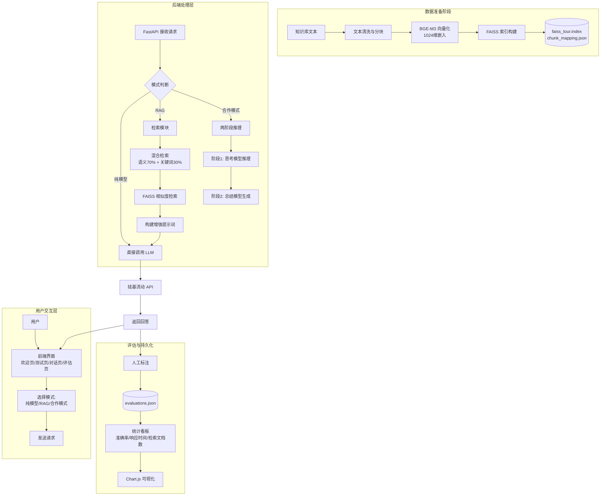

# 旅游知识问答评估系统 —— RAG + 多模型对比平台

> 基于 FastAPI、FAISS 和硅基流动 API 构建的专业旅游领域问答评估系统，支持纯模型、RAG 检索增强、多组合合作推理模式，并提供完整的评估看板。

[](https://www.python.org/)
[](https://fastapi.tiangolo.com/)
[](https://github.com/facebookresearch/faiss)

---

## 📌 项目概述

本系统旨在对比**纯大语言模型**与**检索增强生成（RAG）** 在旅游知识问答任务上的表现，同时支持**合作推理模式**（思考模型 + 总结模型分离）。系统内置四川旅游景点知识库（向量化后存储在 FAISS 中），用户可通过标准化测试集或自由对话进行问答，并人工标注回答准确性，最终生成可视化的评估报告。

### ✨ 核心特性

| 特性               | 描述                                                         |
| ------------------ | ------------------------------------------------------------ |
| **多模式问答**     | 纯模型、RAG（混合/纯语义/纯关键词检索）、合作模式（4种组合） |
| **混合检索策略**   | 语义相似度（FAISS L2 距离）占比 70%，关键词词频占比 30%      |
| **双生成模型**     | DeepSeek-R1（深度推理）、DeepSeek-V3（快速响应），可自由切换 |
| **合作推理流水线** | 支持 R1→V3、V3→R1、R1→R1、V3→V3，实现“思考+总结”分离         |
| **标准化测试集**   | 事实型、推理型、多跳推理型三类问题（基于四川旅游景点）       |
| **自由对话**       | 不限领域的实时问答，同样支持评估记录                         |
| **评估看板**       | 自动统计准确率、平均响应时间、平均检索文档数，表格+柱状图+雷达图展示 |
| **数据持久化**     | 评估记录保存至 JSON 文件，重启不丢失                         |

---

## 🏗️ 系统架构



- **数据准备阶段**
  - 收集旅游知识文本 → 清洗分块（约578块）→ BGE-M3 向量化（1024维）→ FAISS 构建索引，生成 `.index` 和 `chunk_mapping.json`。

- **用户交互层**（前端）
  - 多页面（欢迎/测试/对话/评估），用户选择纯模型 / RAG / 合作模式，发送请求。

- **后端处理层**（FastAPI）

  - 接收请求后模式判断：
    - 纯模型：直接调用 LLM。
    - RAG：执行混合检索（语义70%+关键词30%）→ FAISS 召回 → 构建增强提示 → 调用 LLM。
    - 合作模式：两阶段推理（思考模型 → 总结模型）。

  - 所有 LLM 调用均通过硅基流动 API（DeepSeek-R1/V3）。

- **评估与持久化**
  - 人工标注回答准确性 → 存入 `evaluations.json` → 统计看板（准确率/响应时间/检索文档数）→ Chart.js 可视化。

> 📸 *系统界面截图*：欢迎页、测试页、评估看板等详见实验报告附图。

---

## 🚀 快速开始

### 环境要求

- Python 3.9+
- pip 包管理器
- 有效的硅基流动 API Key（[注册地址](https://siliconflow.cn/)）
- 已训练好的 FAISS 向量库文件（`faiss_tour.index` 和 `chunk_mapping.json`）

### 安装步骤

#### 1. 克隆项目

```bash
git clone https://github.com/your-repo/rag-tour-eval.git
cd rag-tour-eval
```

#### 2. 创建虚拟环境（推荐）

```bash
python -m venv venv
# Windows
venv\Scripts\activate
# Linux/Mac
source venv/bin/activate
```

#### 3. 安装依赖

```bash
pip install -r requirements.txt
```

`requirements.txt` 内容：

```text
fastapi==0.104.1
uvicorn[standard]==0.24.0
numpy==1.24.3
faiss-cpu==1.7.4
requests==2.31.0
pydantic==2.5.0
```

#### 4. 配置 API Key

编辑 `backend/config.py`，将 `API_KEY` 替换为您的实际密钥：

```python
API_KEY = "sk-xxxxxxxxxxxxxxxxxxxxxxxxxxxxxxxx"
BASE_URL = "https://api.siliconflow.cn/v1"
MODEL_R1 = "deepseek-ai/DeepSeek-R1"
MODEL_V3 = "deepseek-ai/DeepSeek-V3"
EMBEDDING_MODEL = "BAAI/bge-m3"
```

#### 5. 准备向量库

将训练好的 FAISS 文件放入 `data/` 目录：

```text
data/
├── faiss_tour.index      # FAISS 索引文件
└── chunk_mapping.json    # 文本块列表（JSON 数组）
```

> 若没有现成向量库，需先运行训练脚本（本项目不包含训练部分，请自行准备）。向量库要求：使用 `BAAI/bge-m3` 模型生成 1024 维向量，文本块大小建议 300 字符左右。

#### 6. 准备测试问题集（可选）

`data/questions.json` 可自定义，格式如下：

```json
{
  "factual": ["九寨沟位于哪个省份？"],
  "reasoning": ["为什么说九寨归来不看水？"],
  "multi-hop": ["从成都出发，先去九寨沟再去黄龙，最佳交通路线？"]
}
```

系统会优先读取该文件，若不存在则使用内置 fallback 问题。

#### 7. 启动服务

在项目根目录执行：

```bash
uvicorn backend.main:app --reload --host 0.0.0.0 --port 8000
```

启动成功日志示例：

```text
INFO:     Uvicorn running on http://0.0.0.0:8000
INFO:     Application startup complete.
向量库加载成功，共 578 个文本块
```

#### 8. 访问系统

浏览器打开 `http://127.0.0.1:8000` 进入欢迎页。

---

## 🌐 页面导航

| 页面       | 路由    | 功能描述                                             |
| :--------- | :------ | :--------------------------------------------------- |
| 欢迎页     | `/`     | 系统简介，卡片式导航                                 |
| 标准化测试 | `/test` | 预置三类问题，支持模式选择、人工评估                 |
| 评估看板   | `/eval` | 展示统计图表（准确率、响应时间、检索文档数、雷达图） |
| 自由对话   | `/chat` | 任意问题问答，同样可评估                             |

---

## 📖 详细使用说明

### 标准化测试页 (`/test`)

**操作流程：**

1. **选择模式**：
   - `纯模型`：从下拉框选择 DeepSeek-R1 或 DeepSeek-V3，不进行检索。
   - `RAG 检索增强`：额外选择检索方式（混合/纯语义/纯关键词），系统会先检索相关文本块，再生成回答。
   - `合作模式`：选择思考模型（R1 或 V3）和总结模型（R1 或 V3），系统会依次调用两个模型，将思考模型的输出作为上下文传递给总结模型。

2. **点击问题卡片**：页面自动发送请求，等待回答生成（合作模式耗时较长，请耐心等待）。

3. **评估回答**：阅读回答内容后，点击 **✓ 准确** 或 **✗ 不准确** 按钮，该条记录将保存到评估数据中。页面会提示“评估已记录 (总计 X 条)”。

> 注意：每个问题可多次评估，但建议只评估一次以保证统计数据合理。

### 评估看板页 (`/eval`)

- **表格**：列出所有已评估的模式组合（如 `pure_R1_none`、`rag_V3_hybrid`、`collab_R1→V3_none`），显示准确率、平均响应时间、平均检索文档数。
- **柱状图**：准确率对比（绿色柱）、响应时间对比（蓝色柱），支持鼠标悬停查看具体数值。
- **雷达图**：多维度（准确率、响应时间、检索文档数）综合评估不同方案。
- **自动刷新**：每 10 秒自动拉取最新统计，无需手动刷新。

> 若没有任何评估记录，表格和图表会显示“暂无数据”。

### 自由对话页 (`/chat`)

- 在文本框中输入任意问题（不限于旅游知识），选择模式（同测试页）。
- 点击“发送”后获取回答，并可对回答进行准确/不准确评估。
- 评估记录会合并到看板中，问题类型标记为 `free_chat`。

---

## 📊 评估指标详解

| 指标               | 计算方式                                             | 说明                                                     |
| :----------------- | :--------------------------------------------------- | :------------------------------------------------------- |
| **准确率**         | 该模式组合下被标记为“准确”的回答数 / 总回答数        | 反映模型在该配置下的回答质量（依赖人工标注，存在主观性） |
| **平均响应时间**   | 所有请求的端到端耗时（从发送到收到完整回答）的平均值 | 反映系统响应速度，合作模式通常比纯模型慢 1.5~2 倍        |
| **平均检索文档数** | 仅对 RAG 模式有效，每次检索返回的文本块数量的平均值  | 反映检索阶段的信息量，通常为 TOP_K=5                     |

> 合作模式若未启用检索，检索文档数为 0。

---

## 🔧 后端 API 文档

### `POST /chat`

请求体示例（纯模型）：

```json
{
  "query": "九寨沟位于哪个省份？",
  "model": "R1",
  "mode": "pure"
}
```

RAG 模式：

```json
{
  "query": "峨眉山最高峰海拔？",
  "model": "V3",
  "mode": "rag",
  "retrieval_mode": "hybrid"
}
```

合作模式：

```json
{
  "query": "都江堰为什么能沿用两千多年？",
  "mode": "collab",
  "collab_type": "R1_to_V3"
}
```

响应示例：

```json
{
  "answer": "四川省阿坝藏族羌族自治州",
  "response_time": 2.345,
  "retrieved_chunks": ["九寨沟位于四川省...", "..."]
}
```

### `POST /evaluate`

请求体：

```json
{
  "query": "九寨沟位于哪个省份？",
  "model": "R1",
  "mode": "pure",
  "retrieval_mode": "none",
  "question_type": "factual",
  "answer": "四川省",
  "response_time": 2.345,
  "retrieved_count": 0,
  "is_accurate": true
}
```

### `GET /stats`

返回聚合统计数据，结构同 `StatsResponse`（包含各模式准确率、响应时间、检索文档数、问题类型分析等）。

### `GET /questions`

返回 `data/questions.json` 内容。

---

## 🗂️ 项目文件结构

```text
rag_webapp/
├── backend/
│   ├── __init__.py
│   ├── main.py              # FastAPI 主应用，包含所有路由
│   ├── models.py            # Pydantic 数据模型
│   ├── rag.py               # 检索核心：FAISS 加载、三种检索方式、提示词构建
│   ├── utils.py             # LLM 调用、嵌入生成、API 封装
│   ├── config.py            # API 密钥、模型名称、权重等配置
│   └── data/                # 自动创建，存放评估记录
│       └── evaluations.json
├── frontend/
│   ├── welcome.html         # 欢迎页
│   ├── test.html            # 标准化测试页
│   ├── eval.html            # 评估看板页
│   ├── chat.html            # 自由对话页
│   ├── style.css            # 全局样式
│   ├── test.js              # 测试页交互逻辑
│   ├── eval.js              # 看板页图表渲染与数据拉取
│   └── chat.js              # 对话页交互逻辑
├── data/
│   ├── faiss_tour.index     # FAISS 向量索引（需提前准备）
│   ├── chunk_mapping.json   # 文本块映射（需提前准备）
│   └── questions.json       # 可选的自定义问题集
├── requirements.txt
└── README.md
```

---

## ❓ 常见问题与故障排查

### Q1: 启动时报错 `ModuleNotFoundError: No module named 'faiss'`

**A**：安装 `faiss-cpu`：`pip install faiss-cpu`。如果使用 GPU，可安装 `faiss-gpu`。

### Q2: 评估记录提交返回 HTTP 500

**A**：可能原因：
- `backend/data/` 目录不存在或无写入权限 → 手动创建目录并赋予权限。
- 请求体缺少必要字段（如 `retrieval_mode`） → 检查前端提交代码，确保字段完整。
- 后端 `models.py` 中 `EvaluateRequest` 字段与提交数据不匹配 → 比对模型定义。

### Q3: 评估页面图表不显示

**A**：打开浏览器开发者工具（F12）→ Console 标签，查看是否有 JavaScript 错误。常见问题：
- 后端 `/stats` 返回的数据结构不完整 → 检查后端 `get_stats` 函数。
- Chart.js / ECharts 未正确加载 → 确认网络通畅，或更换 CDN 地址。

### Q4: 合作模式速度极慢（超过 30 秒）

**A**：合作模式需串行调用两次 LLM API，且硅基流动的 DeepSeek-R1 本身推理速度较慢。建议：
- 将 `max_tokens` 调低（思考过程 300，总结 150）。
- 使用 V3 作为思考模型和总结模型（即 `V3_to_V3`）以提高速度。
- 考虑使用流式输出（当前版本未实现，可自行扩展）。

### Q5: 检索效果不佳，返回无关文本块

**A**：可尝试调整以下参数（位于 `backend/config.py`）：
- `CHUNK_SIZE`：原文本分块大小（默认 300 字符）。
- `SEMANTIC_WEIGHT` / `KEYWORD_WEIGHT`：混合检索权重。
- `TOP_K`：检索返回块数（默认 5）。
- 确保向量库训练时使用了相同的嵌入模型（`BAAI/bge-m3`）。

### Q6: 如何清空所有评估数据？

**A**：删除 `backend/data/evaluations.json` 文件，重启服务即可。

---

## 📈 扩展建议

1. **增加用户认证**：使用 JWT 或 OAuth 保护评估数据。
2. **数据库持久化**：将 `evaluations.json` 替换为 SQLite/PostgreSQL，支持并发写入。
3. **流式输出**：修改后端 `/chat` 接口支持 `stream=True`，前端逐字显示回答。
4. **更多评估指标**：自动计算 BLEU、ROUGE 等客观指标（需提供参考答案）。
5. **支持其他嵌入模型**：如 `sentence-transformers` 本地模型，减少网络延迟。
6. **Docker 部署**：编写 Dockerfile 和 docker-compose，一键启动。

---

## 📄 许可证

本项目仅供教学实验使用，模型调用遵守硅基流动平台服务条款。
